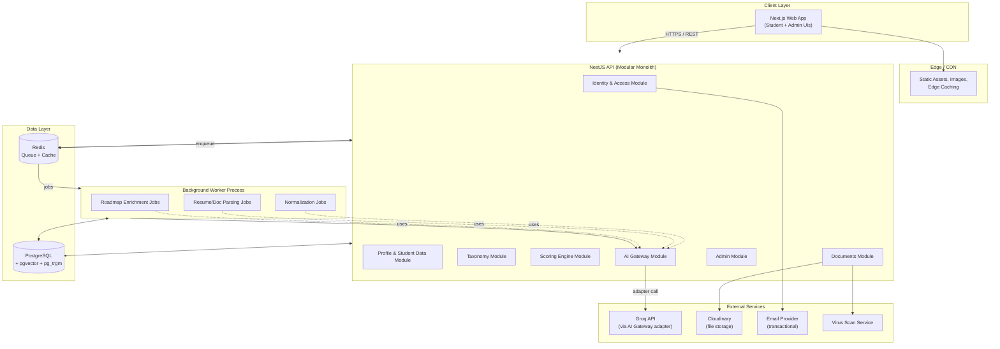
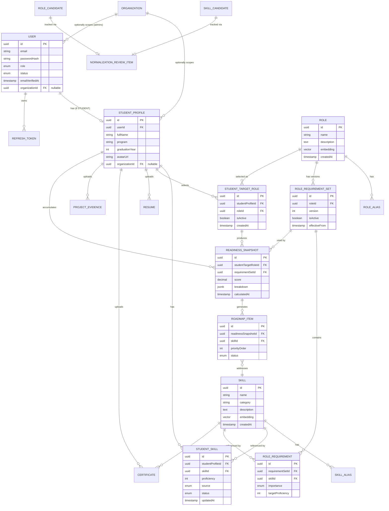
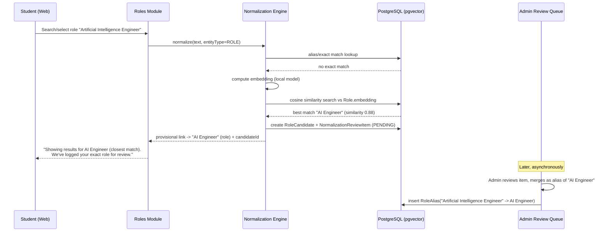
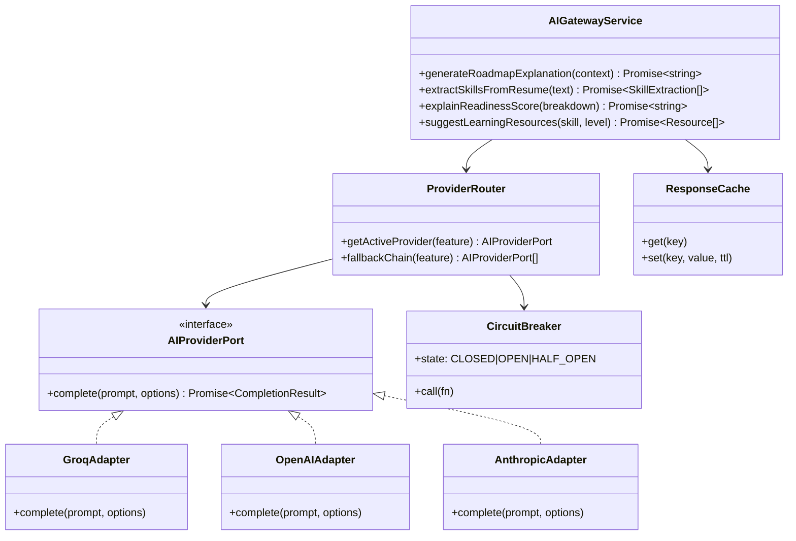
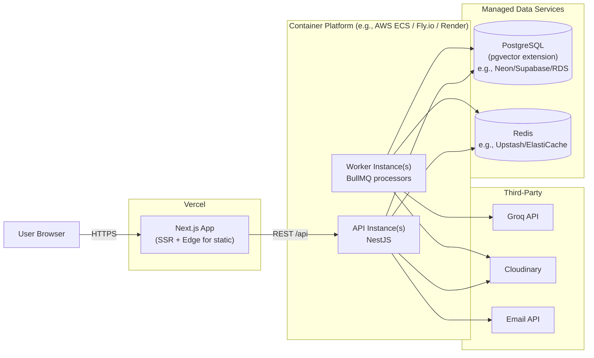
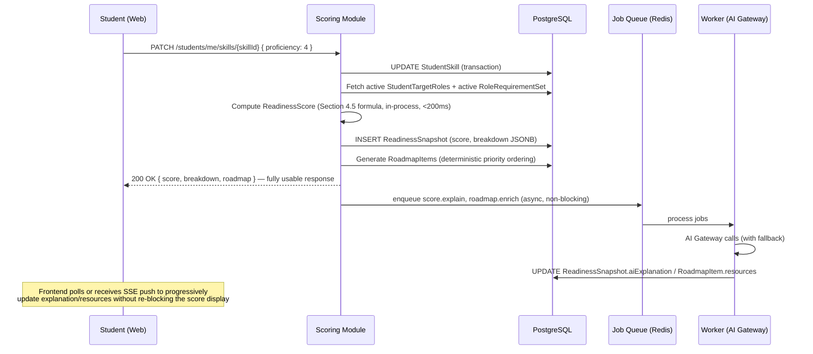

# Skill Gap Intelligence Platform (SGIP)

## Document 2 — Technical Architecture Document

**Version:** 0.1 (Founding Architecture Draft)
**Companion to:** Document 1 (PRD), Document 3 (Security), Document 4 (Frontend)

---

## 1. System Overview

SGIP is a modular monolith at MVP stage, structured internally as if it were a set of services, so that any subdomain (most likely **AI/Normalization** or **Scoring**) can be extracted into a standalone service later without a rewrite. This is a deliberate middle path:

- A full microservices architecture at MVP is a well-known anti-pattern for a team that hasn't yet validated the core loop (PRD Section 1) — it multiplies operational burden (deployments, observability, inter-service auth) before there is traffic to justify it.
- A naive monolith with no internal boundaries risks exactly the failure mode the source brief warns against: AI logic leaking into scoring/auth/CRUD and becoming a hard dependency.

**Resolution:** A single NestJS application composed of strongly-isolated **modules** with explicit **ports** (interfaces) between them, plus a **separate worker process** (same codebase, different entrypoint) for asynchronous AI/processing jobs. The module boundaries map 1:1 to the eventual service boundaries in Section 5, so extraction later is a deployment change, not a redesign.

### 1.1 Core Subsystems

1. **Identity & Access** — auth, users, sessions/refresh tokens, RBAC.
2. **Profile & Student Data** — student profiles, skills, proficiency, documents.
3. **Taxonomy** — canonical skills, canonical roles, aliases, candidates (the normalization substrate).
4. **Normalization Engine** — embedding-based similarity matching + confidence-threshold routing (used by both skills and roles).
5. **Scoring Engine** — deterministic readiness calculation, snapshots, roadmap prioritization.
6. **AI Gateway** — provider-agnostic abstraction over LLM calls (resume parsing, explanations, recommendations), with job queue, caching, circuit breaker, usage logging.
7. **Documents & Storage** — resume/certificate/project file handling via Cloudinary, virus scanning, async parsing triggers.
8. **Admin & Operations** — taxonomy management, normalization review queue, audit log, AI usage dashboard, configuration.
9. **Notifications** — transactional email (verification, password reset, async-job-complete notices).

---

## 2. High-Level Architecture



**Key properties this diagram encodes:**

- The **AI Gateway is the only path** to Groq (or any future provider). No other module imports a provider SDK directly — this is what makes "swap providers with minimal effort" (source brief) actually true rather than aspirational.
- The **Worker process shares the codebase** with the API (same NestJS modules, different `main.ts` bootstrap), so business logic (e.g., scoring rules invoked after a normalization job confirms a new skill) is never duplicated.
- **PostgreSQL is the single source of truth.** Redis is purely for queueing (BullMQ) and ephemeral caching (e.g., AI response cache, rate-limit counters) — it holds nothing that would be a data-loss event if flushed.

---

## 3. Low-Level Architecture — Request/Module Pattern

Every NestJS module follows the same internal layering, to keep the codebase predictable as it grows past a single team:

```
module/
├── controller    -> HTTP boundary, DTO validation (class-validator), guards
├── service       -> domain/business logic (pure-ish, testable, NO direct AI calls)
├── repository    -> Prisma queries, isolated so raw SQL (pgvector/pg_trgm) is centralized
├── dto/          -> request/response shapes
├── entities/     -> domain types distinct from Prisma models (decouples API contracts from schema)
└── ports/        -> interfaces this module depends on (e.g., AIGatewayPort, NormalizationPort)
```

**Rule enforced by lint/architecture tests (e.g., `dependency-cruiser`):** the Scoring module and the Taxonomy module **must not** import anything from the AI Gateway module. The only legitimate dependency direction is `AI Gateway -> Scoring` (AI explains scores) and `Normalization -> Taxonomy` (normalization writes candidates), never the reverse for the core write path. This is the enforceable version of the PRD's "AI should not be responsible for ... scoring calculations" requirement — turning a policy statement into a CI-checked architectural constraint.

---

## 4. Domain Model

### 4.1 Entity Overview

| Entity                                       | Purpose                                           | Notes                                                                                |
| -------------------------------------------- | ------------------------------------------------- | ------------------------------------------------------------------------------------ |
| `User`                                       | Authentication identity                           | Email, password hash, role (`STUDENT`/`ADMIN`), status, emailVerifiedAt              |
| `Organization`                               | Future-proofing for institutions (PRD 3.3)        | Nullable FK on `User`/`StudentProfile`; unused in MVP UI but present in schema       |
| `RefreshToken`                               | Refresh token records                             | Hashed token, family/rotation tracking, revocation, device metadata                  |
| `StudentProfile`                             | Student-specific profile data                     | 1:1 with `User` where role=STUDENT                                                   |
| `Skill`                                      | Canonical skill                                   | Name, category, description, embedding vector                                        |
| `SkillAlias`                                 | Alternative names for a skill                     | Feeds normalization & search                                                         |
| `SkillCandidate`                             | Pending new/unmatched skill                       | Created by normalization pipeline, reviewed by admin                                 |
| `Role`                                       | Canonical career role                             | Name, description, embedding vector                                                  |
| `RoleAlias`                                  | Alternative names for a role                      | Feeds normalization & search                                                         |
| `RoleCandidate`                              | Pending new/unmatched role                        | Same pattern as `SkillCandidate`                                                     |
| `RoleRequirementSet`                         | A versioned snapshot of requirements for a `Role` | `version`, `effectiveFrom`, `isActive`                                               |
| `RoleRequirement`                            | One skill requirement within a set                | `skillId`, `importance` (REQUIRED/IMPORTANT/NICE_TO_HAVE), `targetProficiency` (1–5) |
| `StudentSkill`                               | A student's skill + proficiency + provenance      | `proficiency` (1–5), `source` (SELF/AI_CONFIRMED), `status`                          |
| `StudentTargetRole`                          | A student's chosen target role(s)                 | FK to `Role`, max 3 active per PRD Open Question #3                                  |
| `ReadinessSnapshot`                          | Historical readiness calculation                  | Immutable; references `RoleRequirementSet` version used                              |
| `RoadmapItem`                                | A prioritized gap-closing item                    | Generated from a snapshot; tracks status (TODO/IN_PROGRESS/DONE)                     |
| `Resume` / `Certificate` / `ProjectEvidence` | Uploaded artifacts                                | Cloudinary refs, parsing status                                                      |
| `NormalizationReviewItem`                    | Generalized queue entry for skill/role candidates | Polymorphic-by-discriminator, not by nullable-FK soup (see 4.3)                      |
| `AuditLog`                                   | Append-only record of sensitive actions           | Actor, action, target, before/after diff (Document 3)                                |
| `AIUsageLog`                                 | Per-call AI telemetry                             | Provider, feature, tokens, latency, cost, success/failure                            |

### 4.2 ER Diagram (Core Domain)



### 4.3 Design Decision — Generalized Normalization, Not Parallel Pipelines

The source brief describes role normalization in detail but the same exact problem exists for skills (free-text "TailwindCSS" vs "Tailwind" vs "Tailwind CSS"). Building two bespoke pipelines (`RoleNormalizationService`, `SkillNormalizationService`) would duplicate the embedding-similarity logic, the confidence-threshold routing, and the admin review UI.

**Decision:** A single **Normalization Engine** operates on an `entityType` discriminator (`SKILL` | `ROLE`), with `SkillCandidate`/`RoleCandidate` as thin typed records and `NormalizationReviewItem` as the shared queue table (`entityType`, `candidateId`, `proposedMatchId`, `confidenceScore`, `status`, `reviewerNote`). This is detailed end-to-end in Section 6.3.

### 4.4 Design Decision — Versioned Role Requirements

**Problem with the naive approach:** If `RoleRequirement` rows are simply updated in place when an admin changes requirements (e.g., adds "TypeScript" as required for Full Stack Developer), then every student's historical `ReadinessSnapshot.breakdown` becomes inconsistent with the _current_ requirement definitions — a chart showing "your readiness over time" would show jumps that have nothing to do with the student's actual progress.

**Decision:** `RoleRequirement` rows belong to an immutable `RoleRequirementSet` (versioned). Admin edits create a **new version**; the previous version is retained with `isActive=false`. `ReadinessSnapshot` always references the `requirementSetId` it was computed against. The student-facing dashboard always computes _new_ scores against the currently-active version, but historical snapshots remain interpretable on their own terms — and the UI can optionally show "Note: role requirements were updated on [date]; your trend before this date used a previous definition," satisfying both data integrity and transparency (a brand value per PRD Section 1).

### 4.5 Design Decision — Deterministic Readiness Score Formula

This is the single most important formula in the product (PRD Section 1) and must be specified precisely enough to implement without ambiguity.

For a given `(StudentProfile, Role, RoleRequirementSet)`:

```
For each RoleRequirement r in RoleRequirementSet:
    weight(r)  = { REQUIRED: 3, IMPORTANT: 2, NICE_TO_HAVE: 1 }[r.importance]
    studentProficiency(r) = StudentSkill.proficiency if exists, else 0
    achieved(r) = min(studentProficiency(r), r.targetProficiency) / r.targetProficiency
        # achieved(r) ranges 0.0 (no skill) to 1.0 (meets or exceeds target)

    contribution(r) = weight(r) * achieved(r)
    maxContribution(r) = weight(r) * 1.0

ReadinessScore = 100 * ( Σ contribution(r) / Σ maxContribution(r) )
```

**Classification for the gap report (per requirement r):**

- `MATCHED` if `studentProficiency(r) >= r.targetProficiency`
- `PARTIAL` if `0 < studentProficiency(r) < r.targetProficiency`
- `MISSING` if `studentProficiency(r) == 0`

**Why this formula and not alternatives we considered:**

- _Alternative A — simple percentage of matched skills (binary)_: This is what the source brief's example implies ("matched skills / total required skills"). We reject this as the sole formula because it cannot represent "I know React at a beginner level" vs "I know React at an expert level" — both would count identically, contradicting FR-SKILL-02's entire rationale.
- _Alternative B — AI-computed score_: Rejected outright per source brief's explicit constraint and PRD's "deterministic core" principle. A score that can't be reproduced by re-running the same inputs is untrustable and untestable.
- _Why importance weights of 3/2/1 specifically_: These are configuration values (stored in `PlatformConfig`, FR-ADMIN-07), not hardcoded constants — chosen as a sensible default that gives REQUIRED skills 3x the influence of NICE_TO_HAVE, but admins can tune this platform-wide (with change-history tracking, since it affects all future calculations).

---

## 5. Service Boundaries (Current Modules ↔ Future Services)

| Module (MVP)           | Owns Data                                                                           | Talks To                                     | Future Extraction Candidate?                                                                |
| ---------------------- | ----------------------------------------------------------------------------------- | -------------------------------------------- | ------------------------------------------------------------------------------------------- |
| Identity & Access      | User, RefreshToken                                                                  | —                                            | Low priority — tightly coupled to everything via auth guard                                 |
| Profile & Student Data | StudentProfile, StudentSkill, StudentTargetRole, Resume/Certificate/ProjectEvidence | Taxonomy (read), Documents                   | Low                                                                                         |
| Taxonomy               | Skill, Role, aliases, requirement sets                                              | —                                            | Medium — could become a shared "catalog service" if a second product line emerges           |
| Normalization Engine   | SkillCandidate, RoleCandidate, NormalizationReviewItem                              | Taxonomy, AI Gateway                         | **High** — embedding computation is CPU/GPU-bound and benefits from independent scaling     |
| Scoring Engine         | ReadinessSnapshot, RoadmapItem                                                      | Taxonomy, Profile (read)                     | Medium                                                                                      |
| AI Gateway             | AIUsageLog, response cache                                                          | External providers                           | **High** — natural service boundary; stateless, horizontally scalable, rate-limit-sensitive |
| Documents              | Resume/Certificate metadata                                                         | Cloudinary, AV scanner, AI Gateway (via job) | Medium                                                                                      |
| Admin & Ops            | AuditLog, PlatformConfig                                                            | All (read)                                   | Low                                                                                         |
| Notifications          | —                                                                                   | Email provider                               | Low                                                                                         |

This table exists so that when the platform needs to scale a specific concern (most likely AI Gateway under load, or Normalization Engine if taxonomy submissions spike), the team has a pre-agreed extraction plan rather than an emergency redesign.

---

## 6. Backend Architecture (NestJS)

### 6.1 Module Map

```
apps/api/src/
├── auth/                 # FR-AUTH-*: login, register, refresh, logout, password reset
├── users/                # User CRUD (admin-facing), role assignment
├── profiles/             # StudentProfile CRUD, FR-PROFILE-*
├── skills/               # Canonical Skill CRUD + search, StudentSkill CRUD (FR-SKILL-*)
├── roles/                # Canonical Role CRUD + search, requirement sets (FR-ROLE-*)
├── normalization/        # Normalization Engine (Section 6.3)
├── scoring/              # Readiness calc, snapshots, roadmap (FR-SCORE-*, FR-ROADMAP-*)
├── documents/            # Resume/Certificate/ProjectEvidence (FR-DOC-*)
├── ai-gateway/           # Provider abstraction, adapters, job producers (Section 7)
├── admin/                # Admin dashboards, review queue, config (FR-ADMIN-*)
├── audit/                # AuditLog write-side, used as a cross-cutting interceptor
├── notifications/        # Email sending (verification, reset, async-job notices)
├── common/               # Guards, decorators, pipes, filters, base DTOs
└── workers/              # Worker entrypoint (main-worker.ts), job processors
```

### 6.2 Cross-Cutting Concerns

- **AuthGuard + RolesGuard**: every controller route is `@UseGuards(JwtAuthGuard, RolesGuard)` with `@Roles('STUDENT'|'ADMIN')` — default-deny, explicit allow (Document 3 detail).
- **AuditInterceptor**: applied to all `ADMIN`-role mutation routes and a defined subset of student routes (account deletion, password change) — writes to `AuditLog` after successful response, including before/after diffs for taxonomy/config changes.
- **ValidationPipe (global)**: `class-validator` + `whitelist: true, forbidNonWhitelisted: true` — rejects unknown fields, closing a common mass-assignment vector.
- **Idempotency**: mutation endpoints that may be retried by the frontend (e.g., "confirm AI-suggested skill") accept an `Idempotency-Key` header, stored briefly in Redis to dedupe.

### 6.3 Normalization Engine — Detailed Flow

This is the most architecturally interesting subsystem and deserves a full walkthrough, since the source brief asks for a "scalable architecture for role normalization" and we've generalized it to skills too.

**Step 1 — Input.** A free-text string arrives from one of: student role search (FR-ROLE-02), student skill search (FR-SKILL-05), or AI resume-extraction output (FR-DOC-02).

**Step 2 — Exact/Alias Match (fast path, no AI, no embeddings).** Case-insensitive exact match against `Skill.name`/`Role.name` and their `*Alias` tables (`pg_trgm` index for typo tolerance, e.g., "Reactt" → "React"). If matched, **done** — link immediately, no candidate created. This handles the large majority of inputs cheaply and is why the system "must continue functioning if AI services become unavailable" even for normalization — most normalization never needs AI at all.

**Step 3 — Embedding Similarity (no live AI call).** If no alias match, compute the input's embedding using a **locally-hosted small embedding model** (e.g., a sentence-transformer run in the worker process via `onnxruntime` or similar — explicitly _not_ a call to Groq, since embeddings are a commodity and we don't want normalization's availability tied to an LLM provider's uptime). Compare via `pgvector` cosine similarity against existing `Skill.embedding`/`Role.embedding` rows.

**Step 4 — Confidence Routing:**

| Cosine similarity | Action                                                                                                                                                                                                             | Rationale                                                                             |
| ----------------- | ------------------------------------------------------------------------------------------------------------------------------------------------------------------------------------------------------------------ | ------------------------------------------------------------------------------------- |
| ≥ 0.92            | **Auto-link** to best match                                                                                                                                                                                        | Near-certain synonym (e.g., "JS" vs "JavaScript"); auto-linking keeps UX frictionless |
| 0.75 – 0.92       | Create `*Candidate` + `NormalizationReviewItem` (status `PENDING`), **but** immediately link the student's record to the best-match canonical entity _provisionally_ (FR-ROLE-02's "show results now" requirement) | Balances "never block the student" with "don't silently pollute the taxonomy"         |
| < 0.75            | Create `*Candidate` + `NormalizationReviewItem`, link student record to **nearest match for display purposes only** with a "pending review" indicator                                                              | Likely a genuinely new skill/role                                                     |

These thresholds (0.92 / 0.75) are stored in `PlatformConfig`, not hardcoded — admins can tune based on observed false-positive/negative rates (this is exactly the kind of tuning that should be data-driven post-launch, not guessed once and frozen).

**Step 5 — Admin Resolution (FR-ADMIN-04).** Admin reviews `NormalizationReviewItem`s with three actions:

- **Approve as new canonical entity** → `*Candidate` promoted to `Skill`/`Role`, embedding persisted, any provisional links re-pointed.
- **Merge into existing entity** → candidate's text becomes a new `*Alias` row on the matched entity; all provisional links re-pointed (already correct if Step 4 provisionally linked to the same target).
- **Reject** → candidate marked `REJECTED`; provisional links (if any) revert to "unlinked" and the student is prompted to re-search.

**Step 6 — Why an optional AI step exists (and where).** An LLM call is used _only_ as an optional **disambiguation aid for the admin**, not for the linking decision itself — e.g., generating a one-line explanation of why "AI Solutions Engineer" might map to "AI Engineer" vs "Solutions Architect" when similarity scores are close. This is read-only, advisory, cached, and the review UI functions identically if it's unavailable (just without the AI-generated note).



---

## 7. AI Architecture

### 7.1 Abstraction Layer



**Key points:**

- `AIGatewayService` exposes **feature-level** methods (e.g., `extractSkillsFromResume`), not raw "send a prompt" methods. This keeps prompt templates, output-schema validation (we require structured JSON output and validate it with `zod`/`class-validator` before it ever reaches a domain service), and provider-specific quirks entirely inside the AI Gateway module — domain modules never see provider-specific shapes.
- `ProviderRouter` reads `PlatformConfig` (FR-ADMIN-07) to determine the active provider **per feature** (not globally) — e.g., resume extraction could use one model while roadmap explanations use another, without code changes.
- `CircuitBreaker` (per provider) trips after a configurable failure threshold; while `OPEN`, calls fail fast to a **fallback**: either the next provider in the chain, or — if all providers are unavailable — a deterministic template-based response (FR-SCORE-05's "template-based explanation").
- `ResponseCache` (Redis) caches deterministic-ish outputs (e.g., "learning resources for skill X at level Y") with a TTL, both for cost control and for resilience — a cache hit means a provider outage is invisible to the user for that request.

### 7.2 Async Job Architecture

| Job                   | Trigger                                      | Queue           | Processor                                                                                                                                                          | Output                                                                                    |
| --------------------- | -------------------------------------------- | --------------- | ------------------------------------------------------------------------------------------------------------------------------------------------------------------ | ----------------------------------------------------------------------------------------- |
| `resume.parse`        | FR-DOC-02, resume upload completes           | `documents`     | Worker: extracts text (via library, not AI) → AI Gateway `extractSkillsFromResume` → creates `StudentSkill` rows with `status=PENDING_REVIEW, source=AI_SUGGESTED` | Student notified (in-app + optional email) "Resume processed — review 6 suggested skills" |
| `normalization.embed` | New `SkillCandidate`/`RoleCandidate` created | `normalization` | Computes embedding, runs similarity search (Section 6.3)                                                                                                           | Updates candidate + creates review item                                                   |
| `roadmap.enrich`      | `ReadinessSnapshot` created/updated          | `roadmap`       | For each `RoadmapItem`, calls AI Gateway `suggestLearningResources`; falls back to admin-curated default list per skill if AI unavailable                          | `RoadmapItem.resources` populated                                                         |
| `score.explain`       | `ReadinessSnapshot` created                  | `scoring`       | Calls AI Gateway `explainReadinessScore`; falls back to template                                                                                                   | `ReadinessSnapshot.aiExplanation` populated                                               |

All jobs are **idempotent and re-runnable** (keyed by entity ID + version), so a worker crash mid-job never produces duplicate `StudentSkill`/`RoadmapItem` rows — processors `upsert` rather than `create`.

### 7.3 Why Not Synchronous AI Calls Anywhere in the Critical Path

Even for features that _feel_ like they should be instant (e.g., "explain my score"), the architecture treats them as async-with-immediate-fallback:

1. User sees the deterministic score and template explanation **instantly** (computed server-side, <200ms per NFR).
2. AI-generated explanation streams in (or appears within a few seconds) as a **progressive enhancement**, replacing the template if/when it arrives.
3. If it never arrives (provider down), the template remains — the user never sees a spinner blocking a core number.

This pattern (deterministic-first, AI-as-enhancement) is the concrete implementation of the PRD's "AI should enhance the system, not become a dependency."

---

## 8. Frontend Architecture (Next.js)

### 8.1 Route Structure (App Router)

```
app/
├── (auth)/
│   ├── login/
│   ├── register/
│   ├── verify-email/
│   └── reset-password/
├── (student)/
│   ├── dashboard/
│   ├── profile/
│   ├── skills/
│   ├── roles/                 # browse/select target roles
│   ├── roles/[roleId]/        # gap report + roadmap for a specific target role
│   ├── documents/              # resumes, certificates, projects
│   └── progress/                # readiness history / trend
├── (admin)/
│   ├── dashboard/
│   ├── skills/                  # taxonomy management
│   ├── roles/                   # taxonomy management + requirement sets
│   ├── normalization-queue/
│   ├── users/
│   ├── audit-log/
│   └── settings/                # PlatformConfig, AI provider config
└── layout.tsx, providers.tsx, etc.
```

Route groups `(student)` and `(admin)` each have their own layout with role-gated middleware (Next.js middleware checks JWT claims; backend remains the source of truth via `RolesGuard` — frontend gating is UX-only, never a security boundary, per Document 3).

### 8.2 State Management Strategy

- **Server state** (anything from the API): **TanStack Query** exclusively. Query keys are structured hierarchically (`['student', studentId, 'skills']`, `['role', roleId, 'requirements', version]`) to enable precise invalidation — e.g., adding a skill invalidates `['student', id, 'readiness']` so the score recalculates in the UI without a manual refresh.
- **Client/UI state** (modals, form drafts, wizard steps): local component state or, where shared across distant components (e.g., the multi-step onboarding wizard), a small **Zustand** store scoped to that flow — not a global app-wide store, to avoid the classic "everything is global state" sprawl.
- **Optimistic updates**: used for low-risk, high-frequency interactions (e.g., marking a roadmap item complete, removing a skill) — TanStack Query's `onMutate` rollback pattern. **Not** used for the readiness score itself — that always reflects the server-confirmed value, since showing an "optimistic" score that might revert would directly undermine user trust in the platform's core number.

### 8.3 API Integration Pattern

A generated typed client (from the NestJS OpenAPI spec, via `openapi-typescript` or similar) provides request/response types shared between frontend and backend expectations — reducing drift. TanStack Query hooks wrap this client per-resource (`useStudentSkills()`, `useReadiness(roleId)`, etc.), centralizing error normalization (mapping API error shapes to a consistent `AppError` for the UI's error-state components, Document 4).

---

## 9. Integration Architecture

| Integration                        | Purpose                                                                              | Abstraction                                                                                                                                            | Failure Mode Handling                                                                                                                                                                  |
| ---------------------------------- | ------------------------------------------------------------------------------------ | ------------------------------------------------------------------------------------------------------------------------------------------------------ | -------------------------------------------------------------------------------------------------------------------------------------------------------------------------------------- |
| **Groq (initial AI provider)**     | Resume extraction, explanations, recommendations, normalization disambiguation notes | `AIProviderPort` (Section 7.1)                                                                                                                         | Circuit breaker → fallback provider (if configured) → template/cached response                                                                                                         |
| **Cloudinary (or equivalent)**     | Resume/certificate/project file storage, avatar storage                              | `StoragePort` interface — even with a single provider, an interface avoids vendor lock-in for the inevitable "Cloudinary pricing changed" conversation | Upload failures surfaced synchronously to user (this is NOT async — user needs immediate feedback that an upload failed)                                                               |
| **Virus/malware scanning**         | Pre-processing gate before any uploaded file is parsed or made downloadable          | `ScanPort` — e.g., ClamAV container in infra, or a hosted API                                                                                          | Files held in `QUARANTINED` status until scan completes; scan failure → file rejected, user notified, **never** silently skipped                                                       |
| **Email provider (transactional)** | Verification, password reset, async-job-complete notices                             | `NotificationPort`                                                                                                                                     | Non-blocking — email failures are logged and retried via queue, never block the triggering action (e.g., registration succeeds even if the verification email send is delayed/retried) |
| **Local embedding model**          | Normalization (Section 6.3)                                                          | Hosted inside the worker process (no external network call)                                                                                            | N/A — this is a deliberate design choice to remove a dependency, not an integration to harden                                                                                          |

---

## 10. Deployment Architecture



### 10.1 Environment Strategy

- **Three environments**: `dev` (ephemeral, seed data, mocked AI by default to avoid burning quota), `staging` (production-parity, real AI provider but with stricter rate limits / cheaper model tier), `production`.
- **Infrastructure-as-Code** (Terraform or equivalent) from day one — even for a small footprint, this prevents "works on staging, mystery config drift in prod" and makes the eventual service-extraction (Section 5) tractable.
- **Database migrations**: Prisma Migrate, applied via CI pipeline gate (never manually against production) — with a documented rollback procedure per migration for the versioned-data tables (Section 4.4) where rollbacks are non-trivial.

---

## 11. Infrastructure Recommendations

| Concern                | Recommendation                                                                                                                                | Reasoning                                                                                                                                                      |
| ---------------------- | --------------------------------------------------------------------------------------------------------------------------------------------- | -------------------------------------------------------------------------------------------------------------------------------------------------------------- |
| **Frontend hosting**   | Vercel                                                                                                                                        | Next.js is built by Vercel; best-in-class SSR/edge support, preview deployments per PR (valuable for a UX-heavy, design-sensitive product per Document 4)      |
| **Backend hosting**    | Container platform with autoscaling (Fly.io, Render, or AWS ECS Fargate)                                                                      | NestJS + worker as two services from one image; autoscaling matters most for the AI Gateway under bursty resume-upload traffic (e.g., placement season spikes) |
| **Database**           | Managed PostgreSQL with **pgvector** support (Neon, Supabase, or AWS RDS + extension)                                                         | pgvector is non-negotiable given Section 6.3's design — verify support _before_ committing to a provider, not after                                            |
| **Queue/Cache**        | Managed Redis (Upstash for serverless-friendly billing, or ElastiCache)                                                                       | BullMQ requires Redis; also used for response caching and idempotency keys                                                                                     |
| **File storage**       | Cloudinary (per source brief)                                                                                                                 | Already specified; note Cloudinary's "raw" resource type is needed for PDF/DOCX (not just images) — flagged so it's not discovered late                        |
| **Observability**      | OpenTelemetry instrumentation → a managed APM (e.g., Grafana Cloud, Datadog, or Axiom) + structured JSON logs                                 | Needed from day one per NFR (Section 6, PRD); AI-call spans should carry `provider`, `feature`, `tokens`, `costEstimate` attributes to power FR-ADMIN-06       |
| **Secrets management** | Provider-native secrets (e.g., AWS Secrets Manager / Fly secrets) — never `.env` files in production images                                   | Standard hardening; also referenced in Document 3                                                                                                              |
| **CI/CD**              | GitHub Actions: lint → typecheck → unit tests → architecture-boundary tests (Section 3) → integration tests (with AI mocked) → build → deploy | The "architecture-boundary test" step operationalizes the module-dependency rules in Section 3                                                                 |

---

## 12. Database Architecture Notes (Beyond the ER Diagram)

- **Extensions required**: `pgvector` (Section 6.3), `pg_trgm` (fuzzy alias matching), `pgcrypto` (UUID generation, hashing helpers if needed).
- **Indexing strategy**: B-tree on all FKs and `email` (unique); GIN+`pg_trgm` on `Skill.name`, `Role.name`, and alias tables for autocomplete; HNSW (or IVFFlat, depending on `pgvector` version available) index on `embedding` columns for similarity search at scale — **flagged risk**: IVFFlat indexes require a `lists` parameter tuned to table size; this must be revisited as the taxonomy grows past the initial seed size, or similarity search latency will degrade silently.
- **Soft deletes** for `User`, `StudentProfile`, and taxonomy entities (`deletedAt` nullable timestamp) — supports the "deactivate" admin action (FR-ADMIN-05) and avoids cascading hard-deletes that would orphan `ReadinessSnapshot` history. Hard deletion (for privacy/right-to-erasure requests, Document 3) is a separate, explicit, audited operation distinct from "deactivate."
- **JSONB usage**: `ReadinessSnapshot.breakdown` is JSONB (a structured-but-flexible record of per-requirement matched/partial/missing classifications at calculation time) — deliberately denormalized because this data must remain stable even if `RoleRequirement` rows it referenced are later modified (reinforces Section 4.4).
- **Prisma-specific note**: Prisma's schema language doesn't natively model `vector` columns or partial/expression indexes as of common versions — these require `prisma db execute` migrations with raw SQL, kept in a dedicated `prisma/migrations/*_pgvector_setup` migration with clear comments, so the team doesn't fight Prisma's introspection on every subsequent `migrate dev`.

---

## 13. Data Flow — Readiness Calculation (End-to-End)



---

## 14. Technology Decisions Summary

| Decision                     | Choice                                                           | Primary Alternative Considered                   | Why This Choice                                                                                                                                                                                           |
| ---------------------------- | ---------------------------------------------------------------- | ------------------------------------------------ | --------------------------------------------------------------------------------------------------------------------------------------------------------------------------------------------------------- |
| Internal architecture style  | Modular monolith with strict module boundaries + separate worker | Microservices from day one                       | Avoids premature operational complexity while preserving a clean extraction path (Section 5)                                                                                                              |
| Normalization similarity     | Local embedding model + `pgvector`, **not** LLM-per-lookup       | Calling Groq for every search keystroke          | Cost, latency, and availability — normalization must work even if Groq is down, and embedding-per-search via LLM would be prohibitively slow/expensive at "thousands of skills" scale                     |
| Readiness scoring            | Deterministic weighted formula (Section 4.5)                     | LLM-scored readiness                             | Mandated by source brief; also the only approach that is testable, reproducible, and explainable                                                                                                          |
| Async AI                     | BullMQ (Redis-backed) job queue + worker process                 | Direct synchronous calls with timeouts           | Source brief's hard "must function if AI unavailable" requirement is far easier to guarantee structurally (nothing in the request path _can_ fail due to AI) than to guarantee via careful timeout tuning |
| Role requirements versioning | Append-only versioned sets                                       | In-place mutation                                | Preserves historical score integrity (Section 4.4)                                                                                                                                                        |
| Multi-tenancy                | Schema-ready (`Organization` nullable FK), UI deferred           | Build full multi-tenant UI now / ignore entirely | Cheapest insurance against a costly future migration, without inflating MVP scope (PRD 3.3)                                                                                                               |

---

## 15. Scalability Considerations

1. **Read-heavy taxonomy access**: `Skill`/`Role` browse and autocomplete are read-heavy and highly cacheable (taxonomy changes infrequently relative to reads). Recommend a Redis-backed cache layer in front of taxonomy list/search endpoints with short TTL + explicit invalidation on admin writes.
2. **Readiness recalculation fan-out**: If `RoleRequirementSet` is updated by an admin, recalculating snapshots for _every_ student targeting that role is a potentially large batch job — must be a queued background job (`requirementSet.recalculateAll`), not a synchronous admin-request side effect, and should be rate-limited/chunked to avoid DB connection-pool exhaustion.
3. **AI Gateway as the scaling bottleneck**: Of all subsystems, the AI Gateway/worker is most likely to need independent horizontal scaling during peak periods (placement season resume uploads). Because it's already a separate process (Section 1), scaling it is a deployment config change, not a code change.
4. **Embedding index maintenance** (flagged in Section 12): as `Skill`/`Role` tables grow from "seed data" (hundreds) toward "thousands," `pgvector` index parameters (`lists`/`m`/`ef_construction` depending on index type) need periodic retuning — this should be a scheduled operational task, not a one-time setup step, and is called out explicitly so it doesn't become a silent performance cliff.
5. **Multi-region**: not required for MVP (single-region deployment is acceptable for the stated user base), but the `StoragePort`/`NotificationPort`/`AIProviderPort` abstractions (Section 9, 7.1) mean a future multi-region expansion mainly affects infrastructure config, not application code.
